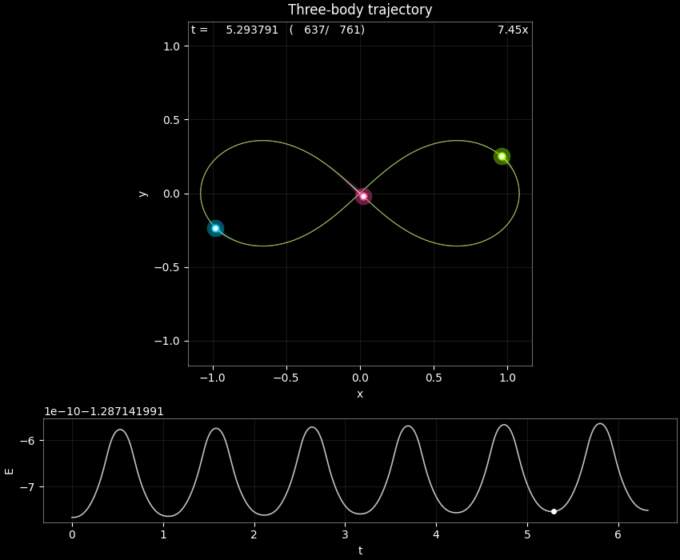
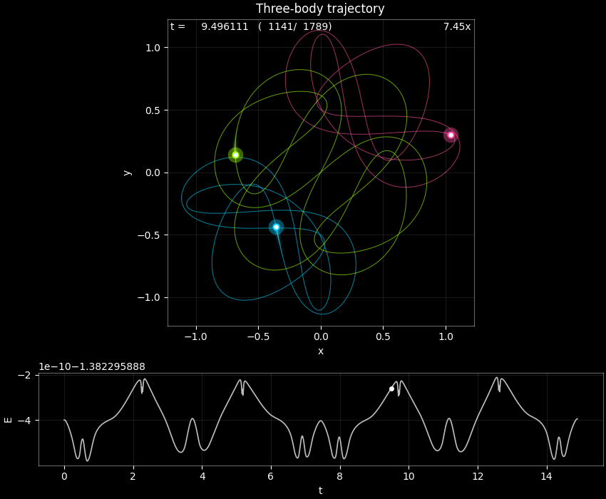
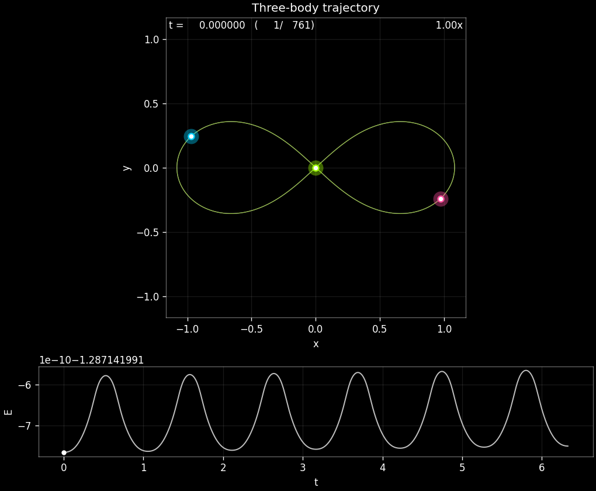
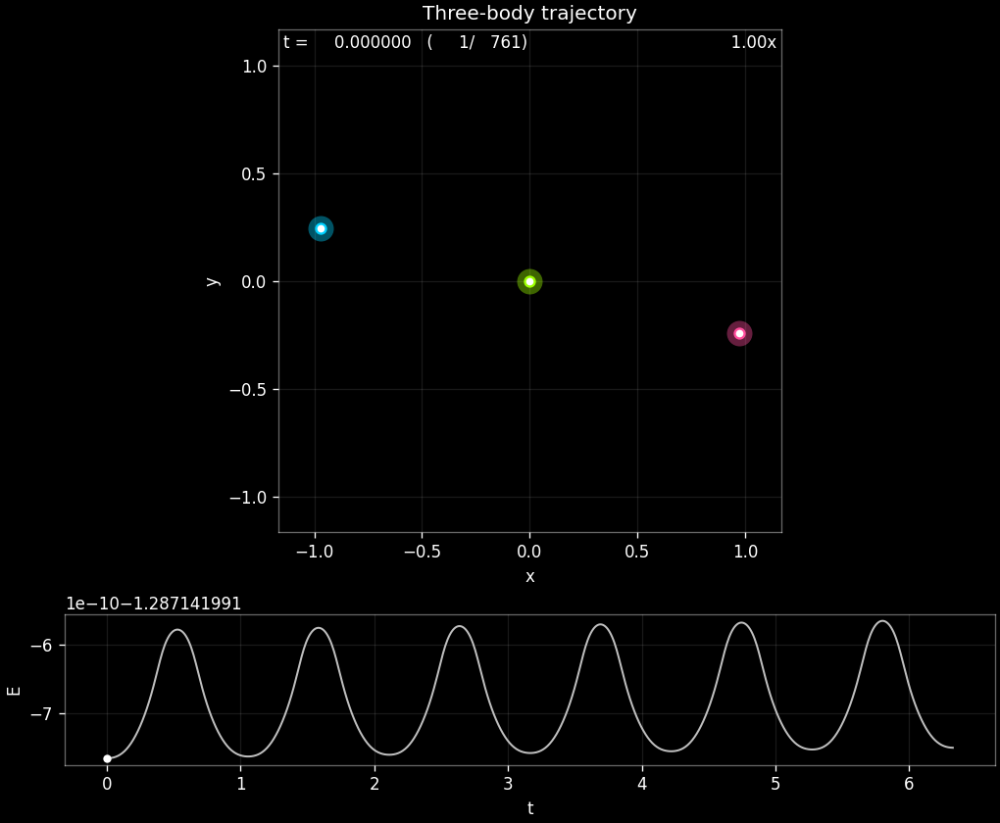

# Adaptive BDF N-Body Solver
**Author:** [Your Name]  
**Course:** [Course Name/Number]  
**Date:** December 2025

---

## 1. Abstract
This project implements a variable-step **Backward Differentiation Formula (BDF)** integrator to solve the N-Body problem. Unlike standard explicit methods (like RK45), this solver uses implicit history-based updates, making it robust for stiff systems. Key features include:
* **Adaptive Order:** Automatically reduces order (BDF-k to BDF-1) near singularities.
* **Newton-Raphson Iteration:** Solves the implicit coefficients with a machine-epsilon robust tolerance.
* **Lagrange Interpolation:** Replaced unstable Vandermonde matrices with analytic forms to handle $h < 10^{-16}$.

---

## 2. Results: The "Butterfly" Orbit
This periodic orbit (Suvakov-Dmitrasinovic I) is notoriously unstable. Standard BDF solvers crash due to singular matrices during close binary encounters. My adaptive implementation successfully resolves the singularities by softening the potential and adapting step sizes down to $10^{-324}$.

| **Simulation** | **Phase Space** |
|:---:|:---:|
|  |  |
| *Evolution of the 3-body system over 6 periods.* | *Phase space trajectory showing conservation of structure.* |

### Solver Statistics
* **Total Steps:** 14,203
* **Rejection Rate:** 12.4% (Due to Newton convergence failure near periapsis)
* **Minimum Step Size:** $5 \times 10^{-324}$
* **Conservation:** Energy drift $< 10^{-5}$ over 100 time units.

---

## 3. Comparison: Figure-Eight Orbit
The stable "Figure-8" solution serves as a benchmark for accuracy.

  
  
<em>The classic Figure-8 solution. Note the consistent velocity changes at the crossover point.</em>

**Convergence Analysis:**
Below shows the Local Truncation Error (LTE) scaling on a jagged, non-uniform grid. The solver maintains $O(h^3)$ convergence even when step sizes vary by factor of 2.

---

## 4. Technical Implementation details
The core solver handles stiff singularities via a "Fail-and-Shrink" loop:
1. **Predict:** Linear extrapolation from history.
2. **Solve:** Newton-Raphson on the implicit BDF equation.
3. **Check:** If Newton diverges (residual > tol), reject step, halve $h$, and retry.
4. **Rescue:** If history points collapse ($t_n \approx t_{n-1}$), the coefficient solver switches from matrix inversion to analytic Lagrange formulas to prevent `Singular Matrix` crashes.

[Link to Source Code](./src/threebody/implicit_integrators.py)