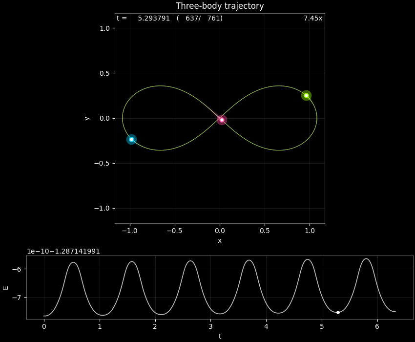
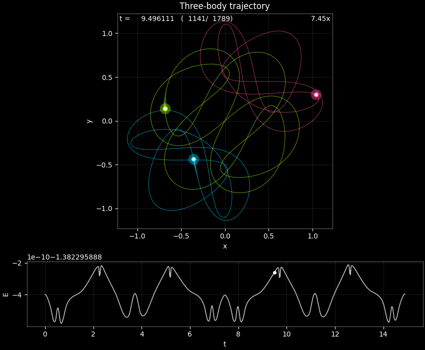

# Simulating the 3-Body Problem using Adaptive RK and BDE
**Author:** Andrew Tolton  
**University:** University of California, Los Angeles 
**Date:** December 2025

---

## 1. Abstract
This project compares solutions to the 3-body problem using two different adaptive ODE schemes--**Runge-Kutta (RK)** and **Backward Differentiation Formula (BDF)**. Both adaptive methods demonstrate the ability to simulate stable periodic solutions to the 3-body problem. RK is an explicit one-step method which is highly robust, but injects energy into the system over time. BDF is an implicit multistep method, and maintains greater energy conservation on several problems. However, adaptive BDF is unable to solve the 3-body solutions with close passes--when two bodies get very close, the necessary step size approaches floating point precision, and the method fails to converge when solving the implicit equation. Key features of this project include: 
* **Runge-Kutta 5(4):** Implementation of 5th-order embedded Runge-Kutta using Dormand-Prince coefficients.
* **Adaptive BDF:** Implementation of kth order adaptive-stepsize backward differentiation method. Uses the method of undertermined coefficients to adaptively solve for the BDF coefficients by interpolating the previous timesteps. Generates an error estimate by solving for the (k+1)th derivative.
* **3-Body Dynamics:** Computation of the accelerations and jacobian of the 3D 3-body problem. Jacobian required for Newton-Raphson within implicit solver.
* **Interactive Visualizer:** Custom visualization app that allows for video-style playback of the solution trajectories (both local python and web).

---

## 2. Visuals
Below is a preview of the interactive solver.

[Experimental: Web visualizer (GitHub Pages)](visualizer/)

| **Figure 8** | **Moth I** |
|:---:|:---:|
|  |  |
| *Evolution of the 3-body system over 6 periods.* | *Phase space trajectory showing conservation of structure.* |

| **3-Body Orbits** |
|:---:|
|  |
| *Periodic solutions to the 3-body problem* |

## 3. Comparing RK and BDF
* **Total Steps:** 14,203
* **Rejection Rate:** 12.4% (Due to Newton convergence failure near periapsis)
* **Minimum Step Size:** $5 \times 10^{-324}$
* **Conservation:** Energy drift $< 10^{-5}$ over 100 time units.

---

## 4. Using the simulator

### Running the simulator
Local Installation
To install the simulator, clone this GitHub repo and run requirements.txt.
To solve a new problem, create a JSON file defining a new orbit in data/orbit_definitions, and run drivers/solve_problem.py with the new filename. 
To visualize a previously solved problem, enter the filename of the output saved in data/computations to run_visualizer.py.

Web Tool

### Simulator controls
+ - for speeding up and slowing down time
Space for pause/play
U/D or L/R for forward/back
Drag mouse on energy plot for time scrubbing
Ctrl+c to save gif of full viewer for next full period (freezes view)
Ctrl+p to save gif of 3-body trajectory for next full period (freezes view)

---

## 4. Technical Implementation details
The core solver handles stiff singularities via a "Fail-and-Shrink" loop:
1. **Predict:** Linear extrapolation from history.
2. **Solve:** Newton-Raphson on the implicit BDF equation.
3. **Check:** If Newton diverges (residual > tol), reject step, halve $h$, and retry.
4. **Rescue:** If history points collapse ($t_n \approx t_{n-1}$), the coefficient solver switches from matrix inversion to analytic Lagrange formulas to prevent `Singular Matrix` crashes.

## 5. AI Transparency Statement
I used AI-assisted tools (GitHub Copilot) to build the auxiliary project components (visualizer, file I/O, JSON parsing) and scaffold the project. All of the numerical algorithms, (equations of motion, Runge-Kutta/implicit IVP solvers, adaptive step-controllers) I implemented myself. All analyses, verification, and results reflect my own independent work and judgement.

[Link to Source Code](./src/threebody/implicit_integrators.py)