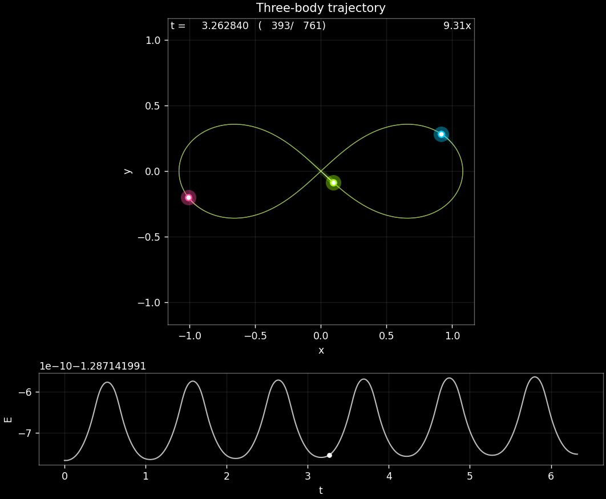
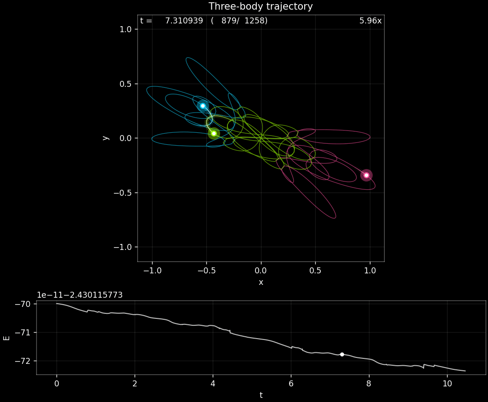
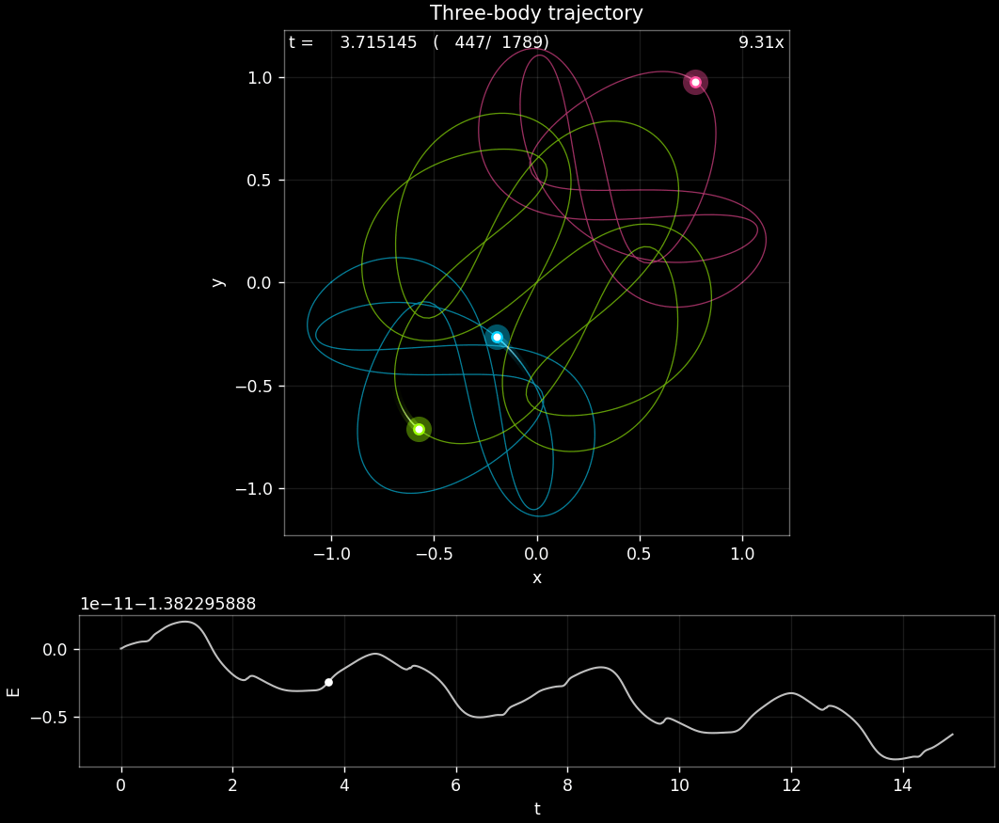
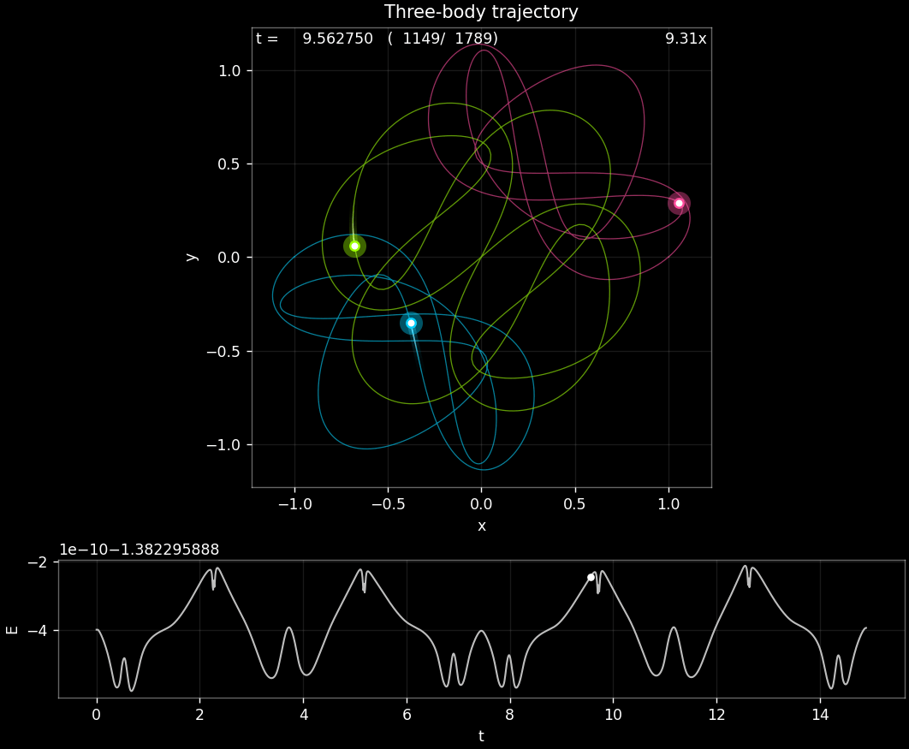

# Simulating the 3-Body Problem using Adaptive RK and BDE
**Author:** Andrew Tolton  
**University:** University of California, Los Angeles 
**Date:** December 2025

---

## 1. Abstract
This project compares solutions to the 3-body problem using two different adaptive ODE schemes--**Runge-Kutta (RK)** and **Backward Differentiation Formula (BDF)**. Both adaptive methods demonstrate the ability to simulate stable periodic solutions to the 3-body problem. RK is an explicit one-step method which is highly robust, but injects energy into the system over time. BDF is an implicit multistep method, and maintains greater energy conservation on several problems. However, adaptive BDF is unable to solve the 3-body solutions with close passes--when two bodies get very close, the necessary step size approaches floating point precision, and the method fails to converge when solving the implicit equation. Key features of this project include: 
* **Runge-Kutta 5(4):** Implementation of 5th-order embedded Runge-Kutta using Dormand-Prince coefficients.
* **Adaptive BDF:** Implementation of kth order adaptive-stepsize backward differentiation method. Uses the method of undertermined coefficients to adaptively solve for the BDF coefficients by interpolating the previous timesteps, and generates an error estimate by solving for the (k+1)th derivative of the interpolating polynomial. Implementation of Newton-Raphson to solve the implicit equations. 
* **3-Body Dynamics:** Computation of the accelerations and jacobian of the 3D 3-body problem. Jacobian required for Newton-Raphson within implicit solver.
* **Interactive Visualizer:** Custom visualization app that allows for video-style playback of the solution trajectories (both local python and web).


The problems showcased here were solved using BDF 5(6) and RK 5(4), using initial conditions from http://dx.doi.org/10.1103/PhysRevLett.110.114301. Solutions show the state evolution of all three bodies, as well as the total energy of the system over time. 
---

## 2. The Simulator

### Interactive Web Version
You can use the embedded viewer below, or open it directly: [visualizer/](visualizer/).

<iframe
  src="visualizer/"
  style="height: 900px;"
  loading="lazy"
></iframe>


### Local Installation
| **Figure 8** | **Goggles** |
|:---:|:---:|
|  |  |
| *Figure-8 solved w/ BDF5(6)* | *Goggles solved w/ RK5(4)* |

To install the simulator, clone this GitHub repo and run requirements.txt.
To solve a new problem, create a JSON file defining a new orbit in data/orbit_definitions, and run drivers/solve_problem.py with the new filename. 
To visualize a previously solved problem, enter the filename of the output saved in data/computations to run_visualizer.py.

Controls:
- + - for speeding up and slowing down time
- Space for pause/play
- L/R for forward/back
- Drag mouse on energy plot for time scrubbing
- Ctrl+c to save gif of full viewer for next full period (freezes view)
- Ctrl+p to save gif of 3-body trajectory for next full period (freezes view)

(It runs much smoother locally than the GIF makes it appear).

---

## 3. Technical Implementation details

### Error Estimation
RK5(4) generates an estimate of the local error by taking the difference between the 5th order solution and an embedded 4th order solution. Adaptive BDF generates a kth order solution by fitting kth order polynomial to the previous k solution points, and solving for the coefficients that cancel the first k+1 terms of the Taylor series expansion. The local error is then estimated by finding the coefficient of the first non-zero term. 

The local error estimate is 12-dimensional for the 2D problem and 18-dimensional for the 3D problem. To generate an acceptance criteria, I divide each component of the local error estimate by the maximum tolerable error (error rate times step size), and take the root mean square. The solution is accepted if the RMS error is less than 1.0 (i.e. RMS error is within tolerance).

The maximum tolerable error is composed of an absolute (atol) and relative (rtol) error component, calculated as 
```max_allowed_error = float(atol) + float(rtol) * np.maximum(|y_prev|, |y_trial|)```

with rtol: float = 1e-10 and atol: float = 1e-10.


### Step Size Determination
The subsequent step size is determined using the current local error estimate. I generate an estimate of what step size will yield a valid next step, and scale it by a factor of 0.9. I additionally bound the change in step size by factors of 0.2 and 5. In implementation, this looks like
$h_t+1 = clip(RMS_err^(-1/(p+1)), 0.2, 5)$.

### BDF Initial Steps
For all problem, I used an initial step size of $h_0 = 1e-3$. BDF5(6) additionally requires 6 initial solution points. I use adaptive RK5(4) to generate these initial conditions, as BDF5 requires a 5th order method for error convergence.

---

## 4. Comparing RK and BDF

| **RK5(4)** | **BDF5(6)** |
|:---:|:---:|
|  |  |
| *Moth I solved w/ RK5(4)* | *Moth I solved w/ BDF5(6)* |

Adaptive Runge-Kutta:
* **Total Attempted Steps:** 5458
* **Total Accepted Steps:** 5458
* **Total Function Evaluations:** 38206
* **Energy Drift:** -6.299e-12 

Adaptive BDF: 
* **Total Attempted Steps:** 46049
* **Total Accepted Steps:** 46034
* **Total Function Evaluations:** 138167
* **Energy Drift:** 5.359e-12

Overall, adaptive RK5(4) outperforms adaptive BDF5(6) for these three-body problems. RK5(4) requires fewer steps, significantly fewer function evaluations (and doesn't need the Jacobian of the system), and for most problems has comparable energy drift. 

There are two interesting distinctions between RK5(4) and BDF5(6). First, while BDF5(6) does not perfectly conserve energy, the total energy of the system remains remarkably symmetric over the period of the orbit. This occurs for all initial conditions. RK5(4) Does not exhibit this behavior. Second, BDF5(6) is unable to find any solution for orbits with close passes, like the 'Goggles' orbit shown above. The solution is extremely stiff, requiring such small step sizes that the Newton-Raphson solver fails to converge. This severely limits the applicability of the BDF5(6) solver in this context. 
---

## 5. AI Transparency Statement
I used AI-assisted tools (GitHub Copilot) to build the auxiliary project components (visualizer, file I/O, JSON parsing) and scaffold the project. All of the numerical algorithms, (equations of motion, Runge-Kutta/implicit IVP solvers, adaptive step-controllers) I implemented myself. All analyses, verification, and results reflect my own independent work and judgement.

[Link to Source Code](./src/threebody)

---

